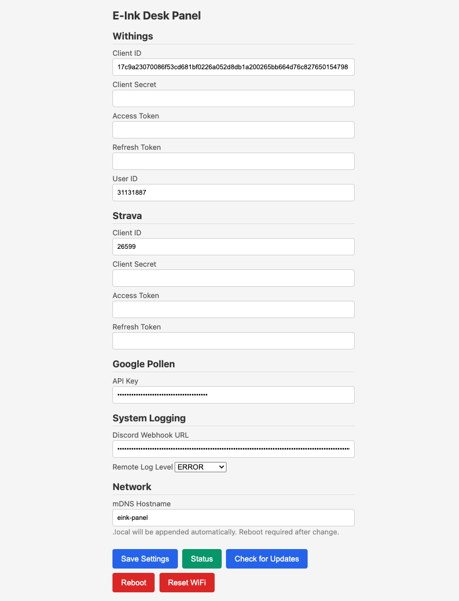

# E-Ink Desk Panel

A multi-panel ESP32-S3 e-ink dashboard displaying weather, river temperature, pollen/UV alerts, body weight, and Strava activity data. Designed for always-on desk use with automatic OTA firmware updates. Supports both 4.2" and 5.79" CrowPanel displays from a single codebase.


## Features

- **Local weather** — temperature, rain detection, and UV index via [Open-Meteo](https://open-meteo.com/) (1 km resolution, no API key)
- **Aare river temperature** — current water temp + commentary from [AareGuru](https://aareguru.ch/)
- **Pollen / UV alerts** — bottom-left shows rain status, UV warnings (>=8), or pollen level
- **Body weight + trend** — from [Withings](https://developer.withings.com/) smart scale, 6-month trend indicator
- **Last activity** — from [Strava](https://developers.strava.com/), toggled via rocker switch
- **OTA updates** — automatic per-panel firmware updates from GitHub Releases
- **Web dashboard** — configure tokens, mDNS hostname, logging, and trigger updates
- **WiFi captive portal** — QR code for easy phone setup, no hardcoded credentials
- **Multi-panel support** — single codebase builds for 4.2" and 5.79" panels
- **Remote logging** — optional Discord webhook for remote diagnostics
- **Configurable mDNS** — set custom `.local` hostname via web dashboard

## Supported Hardware

| Panel | Resolution | Display Driver | Notes |
|-------|-----------|----------------|-------|
| [CrowPanel ESP32 4.2" E-Paper](https://www.elecrow.com/crowpanel-esp32-4-2-e-paper-hmi-display-with-400-300-resolution-black-white-color-driven-by-spi-interface.html) | 400x300 | Single SSD1683 | Original panel |
| [CrowPanel ESP32 5.79" E-Paper](https://www.elecrow.com/crowpanel-esp32-5-79-e-paper-hmi-display-with-272-792-resolution-black-white-color-driven-by-spi-interface.html) | 792x272 | Dual SSD1683 (cascade) | Wider panel, content on left half |

Both panels use the same ESP32-S3-WROOM module and identical SPI pin mapping.

## Display Layout

### 4.2" Panel (400x300)

```
+--------------------------------------+
|                                      |
|    23°              11°              |  large temperatures
|    Local            Aare             |
|                                      |
|         Geduld, geduld               |  AareGuru commentary
|                                      |
|--------------------------------------|
|   low            82.3 kg            |  alerts / weight
|  pollen           stable            |
+--------------------------------------+
```

### 5.79" Panel (792x272)

```
+------------------+-------------------+
|                  |                   |
|   23°     11°   |                   |
|  Local    Aare  |   (right half     |
|                  |    available for  |
| Geduld, geduld  |    future stats)  |
|                  |                   |
|  low    82.3 kg |                   |
| pollen   stable |                   |
+------------------+-------------------+
```

## Quick Start

```bash
git clone https://github.com/githendrik/eink-desk-panel.git
cd eink-desk-panel

# Build for 4.2" panel
~/.platformio/penv/bin/pio run -e panel-42 -t upload

# Build for 5.79" panel
~/.platformio/penv/bin/pio run -e panel-579 -t upload
```

On first boot the device creates a WiFi access point (`EinkPanel`). Connect via the QR code shown on screen or manually join the network and configure via the captive portal.

See [Getting Started](docs/getting-started.md) for full setup instructions.

## Web Dashboard

Access at `http://<hostname>.local` (default: `http://eink-panel.local`). Features:



- Configure Withings/Strava/Google API tokens
- Set custom mDNS hostname
- Configure remote logging (Discord webhook + log level)
- Check for and apply OTA updates
- Reboot device
- View device status (firmware, IP, signal, uptime)

## Documentation

| Doc | Contents |
|-----|----------|
| [Getting Started](docs/getting-started.md) | Setup, build, and first boot |
| [Project Overview](docs/project-overview.md) | Architecture, layout, font system |
| [API Reference](docs/api-reference.md) | All API endpoints and response formats |
| [OAuth Setup](docs/oauth-setup.md) | Withings and Strava credential flow |
| [Release Procedure](docs/release-procedure.md) | How to tag and publish firmware |
| [OTA Architecture](docs/ota-architecture.md) | Design decisions and implementation plan |
| [v2 Changes](docs/v2-changes.md) | What changed from v1 |

## Tech Stack

- **Framework**: PlatformIO + Arduino
- **Weather**: [Open-Meteo](https://open-meteo.com/) (MeteoSwiss ICON-CH1 model)
- **Fonts**: U8g2 via Adafruit GFX bridge (up to 78px Logisoso)
- **Networking**: WiFiManager, ESPAsyncWebServer, mDNS
- **Storage**: ESP32 NVS (Preferences library)
- **CI/CD**: GitHub Actions — tag push builds firmware for both panels
- **Logging**: Optional Discord webhook for remote diagnostics

## License

MIT
